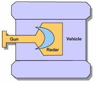

# Curso de Robocode

## Quem sou eu
  - Técnico em informática pelo IFAL-Arapiraca(2016)
  - Graduando em Ciência da Computação pela UFAL Campus A.C. Simões
  - Desenvolvedor fullstack no laboratório de pesquisa EdgeBr em projeto junto a Petrobrás
  - Monitor de programação no Instituto de Computação da UFAL
  - Coordenador do grupo de extensão em maratonas de programação da UFAL (IG)
  - Entusiasta de programação competitiva
  - Organizador dos dois primeiros torneios de robocode IFAL(2014, 2015)
  
## Sumário do curso
  - Robocode
    - O que é?
    - Como funciona?
  - Conceitos básicos de inteligência artificial
    - Agentes
    - Atores
    - Ambiente
    - Relação com robocode
   - Vamos ver na prática.

## O que é Robocode?
O Robocode é um jogo de batalhas entre robôs (tanques) virtuais programados. Se popularizou na IBM e utiliza da linguagem de programação Java (ou .NET) para desenvolver a inteligência artificial dos robôs em questão. As batalhas são acompanhadas em tempo real com representação gráfica. O Robocode é uma ferramenta bem conceituada para a aplicação dos conhecimentos em programação e inteligência artificial. O intuito do jogo é: desenvolver os conhecimentos citados anteriormente e, através disso, criar uma inteligência artificial mais eficaz para que seu tanque destrua seus oponentes.

### Anatomia do rôbo
Um robô é dividido, basicamente, em três partes, o canhão, o radar e por fim o corpo do veículo, veja a imagem representativa abaixo.



### Agora vamos esmiuçar o robô
  - Radar: o randar pode girar 360º e quando encontra um inimigo ativa o método OnScannedRobot(ScannedRobotEvent e)
  - Canhão: O canhão dispara balas de energia para atingir o inimigo
  - Veículo: O veículo da a movimentação do robô

### Detecção do inimigo
O método abaixo é executado sempre que o radar encontra um inimigo, nele você deve desenvolver a lógica do robô ao encontrar um inimigo
```Java
public void onScannedRobot(ScannedRobotEvent e) {

}
```
Através do evento gerado e recebido por parametro através da variável **e** podemos acessar algumas informações do tanque inimigo

### Tiros
  Ao encontrar um inimigo com o radar você pode atirar balas de energia através do canhão para o atingir e diminuir a energia do inimigo e recuperar a sua, o método usado para fazer com que o canhão atire é o **fire**.
```Java
public void OnScannedRobot(ScannedRobotEvent e) {
  fire(1);
}
```
## Perda de energia
Existem **duas** formas de perder energia em uma batalha:
  - Tomar dano por se chocar com as paredes do campo de batalha
    - Toda vez que o seu robô se chocar com a parede o método **onHitWall(HitWallEvent e)** será disparado e através dele você pode tomar as decisões de **o que fazer daqui em diante**.
  - Tomar dano de um disparo inimigo
    - Toda vez que o seu robô for atingido por uma bala inimiga o método **onHitByBullet(HitByBullet e)** é disparado e através dele você determina o que o robô deve fazer nessa situação.
    


No código acima, quando o radar encontrar um inimigo ele dispara uma bala de energia com potência 1, vale lembrar que o canhão se move junto do radar, dessa forma, o canhão atira para onde o radar estiver focando

## Conceitos gerais de IA
### O que é Inteligência Artificial?
Inteligência artificial, de forma superficial, pode ser definido como o estudo e desenvolvimento de modelos de sistemas inteligentes. Para isso, pode-se usar agentes inteligentes, que são aqueles que adotam a melhor ação possível diante de uma situação.

### Agentes

Os agentes são, de maneira geral, algo que percebe seu ambiente através de seus sensores e age sobre ele fazendo uso dos seus atuadores.
  - Sensores: Tudo aquilo utilizado para ter percepção do que acontece no ambiente, o ser humano, por exemplo, usa seus olhos e ouvidos para perceber o que acontece a sua volta.
  - Atuadores: Todo mecanismo usado para agir sobre o ambiente, seguindo o exemplo do ser humano, nós percebemos usando os exemplos supracitados e age sobre o ambiente utilizando suas mãos, pernas e boca.

Um exemplo bem prático é: Quando queremos comer, usamos a visão e o olfato (sensores) para verificar se o alimento não está estragado, então utilizando das mãos e da boca atuamos sobre o ambiente pra comer - além de que, no ato de comer um outro sensor é ativado, o paladar.

## Referências
  - [UFRJ](http://www.ufjf.br/jairo_souza/files/2015/11/Robocode-Manual-de-Instruc%CC%A7o%CC%83es.pdf)
